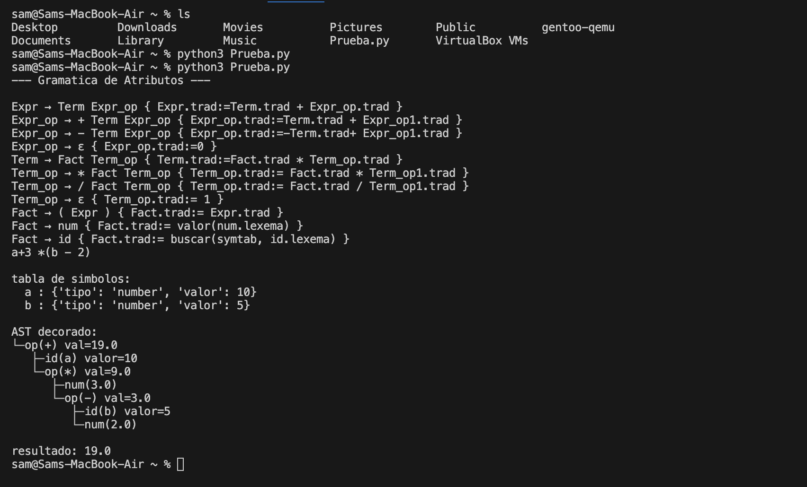

# Traduccion-Dirigida-Por-Sintaxis-

---
Implementacion ETDS para una Gramatica independiente de contexto la cual pueda hacer un analizis ,pueda resolver y graficar por medio de un arbol sintactico decorado la operacion que se le entregue y se encuentre dentro de las reglas .

---

## FuncionamientoPrograma 

Para que el programa se ejecute tenemos que tener todos los archivos descargados o como se desarrollo desde un workspace .

- Todo se puede descargar por medio de este comando en la terminal : 


        ```bash 
        git clone https://github.com/samuelleyton2006/Traduccion-Dirigida-Por-Sintaxis-.git
        ```


Ya estando dentro de la carpeta donde se haya descargado , Unicamente corremos este comando en la terminal : 


    ```
    python Main.py
    ```




